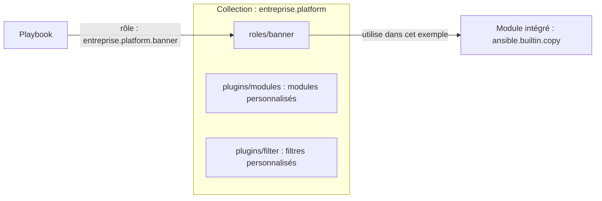
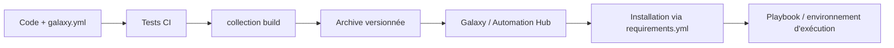

# Collections Ansible — les essentiels

## Sommaire

- [Principe](#principe)
- [Créer une collection](#créer-une-collection)
- [Construire et installer](#construire-et-installer)
- [Utiliser la collection](#utiliser-la-collection)
- [Versionner et partager](#versionner-et-partager)
- [Les réflexes senior](#les-réflexes-senior)
- [Questions classiques](#questions-classiques)

## Principe

Une **collection** est un paquet versionné de contenu Ansible : rôles, modules, plugins et éventuellement playbooks. Elle est identifiée par `namespace.collection` ; son contenu s'appelle avec un **FQCN** : `namespace.collection.nom`.

Un **module** réalise une action (copier un fichier, gérer un utilisateur). Un **rôle** organise des tâches, variables, handlers et templates. Une **collection** distribue ces composants ensemble. [Structure officielle](https://docs.ansible.com/projects/ansible/latest/dev_guide/developing_collections_structure.html).



Une collection n'a pas besoin de contenir tous ces types de composants.

## Créer une collection

Prérequis : un environnement de contrôle Linux ou WSL avec Ansible installé. Les commandes suivantes créent une collection de démonstration :

```bash
ansible-galaxy collection init entreprise.platform
cd entreprise/platform
mkdir -p roles/banner/tasks roles/banner/defaults
```

Structure utile :

```text
entreprise/platform/
├── galaxy.yml           # Identité, version, dépendances de collections
├── README.md
├── meta/runtime.yml     # Compatibilité ansible-core, si renseignée
├── roles/
│   └── banner/
│       ├── defaults/main.yml
│       └── tasks/main.yml
└── plugins/             # Modules et autres plugins, si nécessaires
```

Dans le `galaxy.yml` généré, conserver les métadonnées et définir `version: 1.0.0`. Ce fichier sert à construire le paquet. [Création d'une collection](https://docs.ansible.com/projects/ansible/latest/dev_guide/developing_collections_creating.html).

`roles/banner/defaults/main.yml` :

```yaml
---
banner_message: "Serveur géré par Ansible"
```

`roles/banner/tasks/main.yml` :

```yaml
---
- name: Configurer le message de connexion
  ansible.builtin.copy:
    dest: /etc/motd
    content: "{{ banner_message }}\n"
    owner: root
    group: root
    mode: "0644"
```

Ce rôle converge vers un contenu précis : une seconde exécution sans changement doit retourner `changed=0`.

## Construire et installer

Depuis `entreprise/platform/` :

```bash
ansible-galaxy collection build
ansible-galaxy collection install ./entreprise-platform-1.0.0.tar.gz
ansible-galaxy collection list
```

La collection est installée sur le **nœud de contrôle**, pas avec `ansible-galaxy` sur chaque serveur cible. Dans AWX/AAP, vérifier qu'elle est disponible dans l'environnement d'exécution du job. [Installation des collections](https://docs.ansible.com/projects/ansible/latest/collections_guide/collections_installing.html).

## Utiliser la collection

Dans un dossier de projet, créer `inventory.ini` avec un serveur de lab accessible en SSH (adresse et utilisateur à adapter) :

```ini
[linux]
lab ansible_host=192.0.2.10 ansible_user=ubuntu
```

Puis créer `site.yml` :

```yaml
---
- name: Configurer les serveurs Linux
  hosts: linux
  become: true
  roles:
    - role: entreprise.platform.banner
      vars:
        banner_message: "Environnement de lab"
```

```bash
ansible-playbook -i inventory.ini site.yml --syntax-check
ansible-playbook -i inventory.ini site.yml --check --diff
# Après revue, appliquer sur le lab :
ansible-playbook -i inventory.ini site.yml
```

Le compte distant doit pouvoir utiliser `sudo` ; ajouter `--ask-become-pass` si nécessaire. Le FQCN évite les ambiguïtés entre contenus de même nom.

## Versionner et partager

Après publication de votre collection sur le Galaxy ou Hub configuré, fixer sa version dans `requirements.yml` :

```yaml
---
collections:
  - name: entreprise.platform
    version: "1.0.0"
```

```bash
ansible-galaxy collection install -r requirements.yml
```

`entreprise.platform` est un exemple : il doit être publié sur votre serveur pour que cette installation fonctionne. Pour le lab, utiliser l'archive locale construite précédemment.

Le producteur déclare les dépendances **entre collections** dans `galaxy.yml`. Le consommateur sélectionne les collections et versions dans `requirements.yml`. Publier une nouvelle version pour chaque livraison : patch pour un correctif compatible, minor pour un ajout compatible, major pour une rupture.



## Les réflexes senior

- **Contrat clair** : préfixer les variables du rôle (`banner_`), documenter les entrées et garder les valeurs configurables dans `defaults/`. Utiliser `meta/argument_specs.yml` au niveau du rôle pour valider ses paramètres lorsque nécessaire.
- **Idempotence** : préférer les modules déclaratifs à `shell` ou `command`. Pour une commande indispensable, définir des conditions et un résultat `changed` corrects.
- **Compatibilité** : déclarer les versions d'`ansible-core` supportées via `requires_ansible` dans `meta/runtime.yml`, et tester cette plage.
- **Tests** : `ansible-lint` pour la qualité, tests de rôles avec Molecule ou scénarios d'intégration, `ansible-test` pour les modules/plugins. Vérifier la deuxième exécution et le mode check sur un lab.
- **Reproductibilité** : fixer les versions des collections et maîtriser leurs dépendances transitives, Python et système. Installer une collection ne suffit pas à installer tous les SDK qu'elle utilise ; un Execution Environment permet de les regrouper.
- **Secrets** : utiliser Vault ou les credentials de la plateforme ; protéger les sorties avec `no_log` si nécessaire. `--diff` peut exposer du contenu sensible.

## Questions classiques

**Rôle ou collection ?** Le rôle structure une automatisation ; la collection est l'unité de distribution et de versionnement pouvant contenir plusieurs rôles et plugins.

**`ansible-core` ou `ansible` ?** `ansible-core` fournit le moteur et les éléments intégrés, notamment `ansible.builtin`. Le paquet `ansible` ajoute une sélection de collections communautaires.

**Le mode check garantit-il l'application ?** Non. Il dépend du support des modules et ne reproduit pas tous les effets réels. Le compléter par des tests d'intégration.

**Comment livrer une évolution sans casser les consommateurs ?** Maintenir les entrées compatibles, tester les usages existants, publier une version identifiée et documenter les changements. Pour une rupture, prévoir une version majeure et une migration.

**Une collection est installée mais introuvable : que vérifier ?** Le FQCN, `ansible-galaxy collection list`, les chemins de collections et l'environnement réel du job. Une installation locale n'est pas automatiquement disponible dans un conteneur d'exécution.
