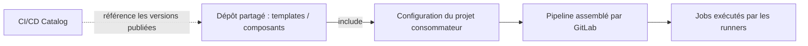

# Catalogue et bibliothèque CI/CD GitLab

## Sommaire

- [Principe](#principe)
- [Bibliothèque de templates](#bibliothèque-de-templates)
- [Créer un composant](#créer-un-composant)
- [Utiliser et publier](#utiliser-et-publier)
- [Les réflexes senior](#les-réflexes-senior)
- [Questions classiques](#questions-classiques)

## Principe

Une **bibliothèque CI/CD** est un dépôt de configurations YAML réutilisables. Un **composant** fournit une configuration appelable avec des paramètres. Le **CI/CD Catalog** permet de découvrir les composants publiés et leurs versions. Ici, « library » désigne cette bibliothèque de pipelines, pas le Package Registry.



Le catalogue facilite la découverte ; le runner exécute les jobs. [Composants et catalogue](https://docs.gitlab.com/ci/components/).

## Bibliothèque de templates

Dans un dépôt partagé `platform/ci-library`, créer `templates/test.yml` :

```yaml
.test-base:
  image: busybox:1.36.1
  script:
    - echo "Test partagé OK"
```

Dans le `.gitlab-ci.yml` du projet consommateur :

```yaml
include:
  - project: platform/ci-library
    ref: '1.0.0'
    file: /templates/test.yml

test-app:
  extends: .test-base
  stage: test
```

Le tag `1.0.0` doit exister dans le dépôt partagé et l'utilisateur qui déclenche le pipeline doit y avoir accès. Le job caché `.test-base` sert de modèle ; `test-app` l'utilise avec `extends`.

`include:local` charge un fichier du même dépôt ; `include:project` charge celui d'un autre projet. Les tableaux comme `script` ne sont pas concaténés par `extends` : une redéfinition remplace la valeur héritée. [Référence YAML](https://docs.gitlab.com/ci/yaml/).

## Créer un composant

Exemple de dépôt `platform/ci-components` :

```text
ci-components/
├── README.md
├── .gitlab-ci.yml
└── templates/
    └── smoke-test.yml
```

Dans `templates/smoke-test.yml` :

```yaml
spec:
  inputs:
    job-name:
      type: string
      default: smoke-test
      description: Nom unique du job
    stage:
      type: string
      default: test
      description: Stage défini par le consommateur
---
"$[[ inputs.job-name ]]":
  stage: $[[ inputs.stage ]]
  image: busybox:1.36.1
  script:
    - echo "Composant CI opérationnel"
```

`spec:inputs` définit le contrat ; `---` sépare cet en-tête des jobs. Les inputs sont validés et interpolés lors de la création du pipeline. Ils peuvent aussi être utilisés dans des templates classiques : ils ne sont pas réservés aux composants. [Inputs CI/CD](https://docs.gitlab.com/ci/inputs/).

## Utiliser et publier

Dans le projet consommateur, après création du tag `1.0.0` :

```yaml
stages: [test]

include:
  - component: $CI_SERVER_FQDN/platform/ci-components/smoke-test@1.0.0
    inputs:
      job-name: test-app
      stage: test
```

Adapter les chemins à vos projets. Un runner éligible acceptant les jobs sans tag est nécessaire ici ; si votre runner exige `local`, ajouter `tags: [local]` au job du composant pour ce lab.

Pour publier au catalogue : renseigner la description du projet et son README, activer **CI/CD Catalog project** dans les paramètres généraux, puis créer une release depuis un job utilisant le mot-clé `release` sur un tag SemVer, après les tests. Le tag seul ne publie pas au catalogue. Un composant peut être utilisé sans cette publication. [Publication officielle](https://docs.gitlab.com/ci/components/#publish-a-new-release).

## Les réflexes senior

- **Contrat simple** : exposer uniquement les paramètres utiles, avec types, descriptions et valeurs par défaut adaptées. Documenter les stages, images et droits requis.
- **Éviter les collisions** : donner un nom configurable aux jobs. Un composant est fusionné dans le pipeline consommateur ; il n'est pas isolé. Éviter les réglages globaux qui changeraient les autres jobs.
- **Maîtriser les versions** : préférer une version exacte et des tags protégés ; un SHA apporte une référence immuable. Prévoir une migration lors d'une rupture de contrat.
- **Tester l'intégration** : vérifier avec CI Lint, puis exécuter un pipeline consommateur de test. Dans le dépôt du composant, inclure la révision `$CI_COMMIT_SHA` pour tester le code candidat avant sa publication.
- **Limiter les privilèges** : relire le code partagé comme du code applicatif. Garder les secrets dans les variables CI/CD adaptées ou un gestionnaire de secrets, avec des droits minimaux.
- **Livrer progressivement** : tester une mise à jour sur quelques consommateurs avant généralisation et conserver une version précédente utilisable.

## Questions classiques

**`include` ou `extends` ?** `include` importe une configuration ; `extends` permet à un job d'hériter d'une autre définition. Les deux se combinent.

**Composant ou pipeline enfant ?** Un composant enrichit la configuration du pipeline courant. Un pipeline enfant est un pipeline distinct déclenché depuis le parent.

**Inputs ou variables ?** Les inputs définissent une interface validée à la création du pipeline. Les variables servent notamment à fournir des valeurs aux jobs pendant leur exécution. Ne pas passer un secret en clair dans un input.

**L'inclusion récupère-t-elle les scripts du dépôt partagé ?** Non. Importer le YAML ne clone pas automatiquement les scripts voisins dans le workspace du job. Les embarquer dans une image versionnée ou prévoir explicitement leur récupération.

**Peut-on consommer un composant GitLab.com depuis une instance privée ?** Les références de composants ciblent la même instance. Il faut rendre le projet disponible sur l'instance privée, par exemple par un miroir.

**Pourquoi le job inclus n'apparaît-il pas comme prévu ?** Examiner la configuration fusionnée, les noms de jobs, les `rules`, les stages et les droits d'accès au dépôt partagé. Distinguer une erreur de création du pipeline d'un job en attente de runner.
