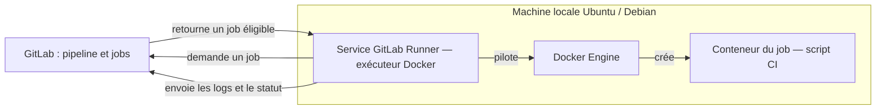
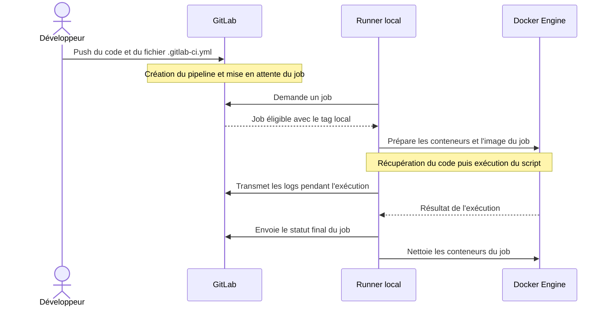

# GitLab Runner Local

## Sommaire

- [Objectif](#objectif)
- [Architecture](#architecture)
- [Prérequis](#prérequis)
- [Installation du GitLab Runner](#installation-du-gitlab-runner)
  - [Ubuntu / Debian](#ubuntu--debian)
  - [Vérifier Docker](#vérifier-docker)
- [Création du Runner dans GitLab](#création-du-runner-dans-gitlab)
- [Enregistrement du Runner](#enregistrement-du-runner)
- [Vérification](#vérification)
- [Configuration GitLab CI/CD](#configuration-gitlab-cicd)
- [Fonctionnement des tags](#fonctionnement-des-tags)
- [Exécution du pipeline](#exécution-du-pipeline)
- [Vérification du runner utilisé](#vérification-du-runner-utilisé)
- [Démarrage du runner](#démarrage-du-runner)
- [Configuration du runner](#configuration-du-runner)
- [Différence entre les runners](#différence-entre-les-runners)
- [Dépannage](#dépannage)
- [Les réflexes senior](#les-réflexes-senior)
- [Questions classiques](#questions-classiques)
- [Références](#références)
- [Conclusion](#conclusion)

## Objectif

Ce projet montre comment utiliser un GitLab Runner local avec l’exécuteur Docker afin d’exécuter des pipelines GitLab CI/CD sans infrastructure Kubernetes/OpenShift.

---

# Architecture



Le runner initie la communication avec GitLab. L'exécuteur Docker lance le script du job dans un conteneur sur la machine locale.

---

# Prérequis

* Une machine Ubuntu / Debian avec `sudo` et systemd pour suivre ce guide
* Docker Engine installé et démarré ([installation officielle](https://docs.docker.com/engine/install/))
* Accès à une instance GitLab
* Un projet GitLab avec les droits nécessaires pour créer un runner de projet
* Accès réseau à GitLab et aux registres des images Docker utilisées

Le runner exécute les jobs sur votre machine, mais GitLab reste nécessaire pour orchestrer le pipeline. La machine doit rester allumée et connectée pendant les jobs.

---

# Installation du GitLab Runner

## Ubuntu / Debian

```bash
curl -fsSL "https://packages.gitlab.com/install/repositories/runner/gitlab-runner/script.deb.sh" -o script.deb.sh

# Examiner le script avant de l'exécuter.
less script.deb.sh
sudo bash script.deb.sh
sudo apt-get install gitlab-runner
```

Vérification :

```bash
gitlab-runner --version
```

Cette méthode utilise le dépôt officiel et installe les dépendances du paquet.

## Vérifier Docker

```bash
sudo systemctl enable --now docker
sudo docker info
sudo docker run --rm busybox:1.36.1 echo "Docker OK"
```

La suite utilise le runner en **mode service système**, avec les commandes `sudo gitlab-runner` et la configuration `/etc/gitlab-runner/config.toml`.

---

# Création du Runner dans GitLab

Dans GitLab :

```text
Project -> Settings -> CI/CD -> Runners
```

Créer un nouveau runner de projet, définir le tag `local` dans GitLab et désactiver **Run untagged jobs** pour réserver ce runner aux jobs explicitement ciblés. Puis récupérer :

* URL GitLab
* Authentication token

Le jeton d'authentification commence par `glrt-`. Le conserver comme un secret : ne pas le committer ni publier le fichier `config.toml`. Les tags se configurent dans GitLab avec ce workflow.

---

# Enregistrement du Runner

```bash
sudo gitlab-runner register
```

Exemple :

```text
Enter the GitLab instance URL:
https://gitlab.example.com

Enter the runner authentication token:
glrt-xxxxxxxx

Enter a description:
runner-local-zakaria

Enter an executor:
docker

Default Docker image:
busybox:1.36.1
```

---

# Vérification

Afficher les runners enregistrés :

```bash
sudo gitlab-runner list
sudo gitlab-runner verify
sudo systemctl enable --now gitlab-runner
sudo gitlab-runner status
```

Dans GitLab, vérifier que le runner apparaît en ligne. `verify` contrôle la connexion des runners enregistrés à GitLab ; il ne prouve pas qu'un job Docker peut s'exécuter. Le pipeline ci-dessous sert de test complet.

---

# Configuration GitLab CI/CD

Créer le fichier `.gitlab-ci.yml` à la racine du projet GitLab :

```yaml
stages:
  - test

test-local:
  stage: test
  tags:
    - local
  image: busybox:1.36.1
  script:
    - echo "Runner local OK"
    - echo "Current user:"
    - whoami
    - echo "Hostname:"
    - hostname
```

---

# Fonctionnement des tags

Le champ :

```yaml
tags:
  - local
```

permet à GitLab de sélectionner le runner possédant le tag `local`.

Un job sans tag peut être pris par un runner disponible pour le projet uniquement si **Run untagged jobs** est activé. Un job avec plusieurs tags exige un runner qui possède tous ces tags. Le tag `local` ne garantit pas l'identité du runner si plusieurs runners le possèdent.

---

# Exécution du pipeline

Push du projet :

```bash
git add .gitlab-ci.yml
git commit -m "test runner local"
git push
```

Le pipeline démarre automatiquement.



Ce scénario suppose un runner disponible et autorisé pour le projet ; les tags seuls ne suffisent pas à garantir l'exécution.

---

# Vérification du runner utilisé

Dans les logs GitLab :

```text
Running with gitlab-runner ...
on runner-local-zakaria
Preparing the "docker" executor
```

Si vous voyez :

```text
Preparing the "kubernetes" executor
```

alors le job utilise un runner avec l'exécuteur Kubernetes. Cela ne permet pas de déduire s'il s'agit d'un runner de projet, de groupe ou d'instance. Vérifier le nom et l'identifiant du runner dans les logs et dans GitLab.

---

# Démarrage du runner

Mode service, utilisé dans ce guide :

```bash
sudo gitlab-runner start
```

Pour un diagnostic au premier plan, arrêter d'abord le service afin de ne pas lancer deux processus avec la même configuration :

```bash
sudo gitlab-runner stop
sudo gitlab-runner run --config /etc/gitlab-runner/config.toml
# Après Ctrl+C, redémarrer le service :
sudo gitlab-runner start
```

---

# Configuration du runner

Fichier :

```bash
/etc/gitlab-runner/config.toml
```

Sans `sudo`, le mode utilisateur utilise `~/.gitlab-runner/config.toml`. Éviter de mélanger les deux modes : le service système ne lit pas automatiquement les runners enregistrés dans votre dossier personnel.

Extrait minimal à comparer avec le fichier généré par l'enregistrement (ne pas remplacer votre véritable jeton par l'exemple) :

```toml
[[runners]]
  name = "runner-local-zakaria"
  url = "https://gitlab.example.com"
  token = "glrt-xxxx"
  executor = "docker"

  [runners.docker]
    image = "busybox:1.36.1"
    privileged = false
```

---

# Différence entre les runners

| Type            | Description                             |
| --------------- | --------------------------------------- |
| Project runner  | Disponible uniquement pour un projet    |
| Group runner    | Partagé entre les projets d’un groupe   |
| Instance runner | Disponible pour toute l’instance GitLab |

Ces portées sont indépendantes de l'exécuteur choisi : Docker, Shell ou Kubernetes, par exemple.

---

# Dépannage

* **Job bloqué en pending / stuck** : vérifier que le runner est en ligne, non suspendu, disponible pour ce projet et possède le tag `local`. Vérifier aussi si le runner est réservé aux branches ou tags protégés.
* **Runner absent de `list`** : utiliser `sudo gitlab-runner list` et vérifier le chemin de configuration. Un enregistrement sans `sudo` utilise le mode utilisateur.
* **Cannot connect to the Docker daemon** : vérifier `sudo systemctl status docker` puis `sudo docker info`.
* **Permission denied sur le socket Docker** : vérifier le compte du service et ses droits sur `/var/run/docker.sock`. Ne pas rendre le socket accessible à tous avec `chmod 666` ; l'accès à Docker donne des privilèges élevés sur l'hôte.
* **Erreur de téléchargement d'image** : vérifier l'accès réseau au registre, le nom de l'image et, pour un registre privé, les identifiants nécessaires.
* **Erreur TLS avec GitLab** : configurer le certificat de l'autorité interne sur l'hôte et, si nécessaire, pour le runner ; ne pas désactiver la vérification TLS.

Consulter les derniers logs du service :

```bash
sudo journalctl -u gitlab-runner -n 100 --no-pager
```

Le test BusyBox ne nécessite ni mode privilégié ni montage du socket Docker dans le conteneur du job. Construire des images Docker dans un pipeline demande une configuration supplémentaire.

---

# Les réflexes senior

* **Séparer portée et exécuteur** : projet/groupe/instance définit qui peut utiliser le runner ; Docker/Shell/Kubernetes définit comment le job s'exécute.
* **Protéger l'hôte** : conserver `privileged = false` lorsque possible, éviter d'exposer le socket Docker aux jobs et séparer les workloads de niveaux de confiance différents. Un conteneur n'est pas une garantie d'isolation absolue. [Sécurité des runners](https://docs.gitlab.com/runner/security/).
* **Contrôler les accès** : les tags orientent les jobs, mais ne remplacent pas les restrictions de projet et de branches protégées. Garder les jetons hors du dépôt et limiter les secrets accessibles aux jobs.
* **Dimensionner la capacité** : `concurrent` limite les jobs simultanés du processus Runner, `limit` ceux d'une entrée runner et `request_concurrency` les requêtes simultanées de nouveaux jobs. Ajuster selon CPU, mémoire, disque et temps d'attente. [Configuration avancée](https://docs.gitlab.com/runner/configuration/advanced-configuration/).
* **Rendre les builds reproductibles** : utiliser des images maîtrisées, idéalement référencées par digest pour les usages critiques ; tester les mises à jour du runner et des images avant généralisation.
* **Diagnostiquer par étape** : distinguer attente d'affectation, préparation Docker, récupération du code et échec du script. Croiser les logs du job avec ceux du service avant de modifier la configuration.

---

# Questions classiques

**GitLab ou Runner : qui fait quoi ?** GitLab orchestre le pipeline. Le runner demande un job, l'exécute via son exécuteur et renvoie les logs et le statut.

**Pourquoi un job reste-t-il en pending malgré le bon tag ?** Vérifier que le runner est en ligne, non suspendu, autorisé pour le projet et la référence Git, possède tous les tags demandés et dispose de capacité.

**Docker executor signifie-t-il Docker-in-Docker ?** Non. L'exécuteur Docker lance les jobs dans des conteneurs. Docker-in-Docker est une configuration supplémentaire pour faire tourner un daemon Docker dans un conteneur, par exemple pour construire des images.

**Cache ou artifacts ?** Le cache accélère les jobs en réutilisant des dépendances ; le pipeline doit supporter son absence. Les artifacts conservent ou transmettent des résultats de jobs, comme un binaire ou un rapport, avec une durée de rétention définie. [Cache et artifacts](https://docs.gitlab.com/ci/caching/).

**`verify` réussit : le runner est-il opérationnel ?** Cela confirme la connexion à GitLab, pas le fonctionnement de Docker ni la réussite d'un job. Lancer un pipeline minimal pour valider le parcours complet.

**Un runner local convient-il à la production ?** Le lieu d'exécution ne suffit pas à décider. Il faut garantir disponibilité, capacité, isolation, supervision et maintenance. Un poste qui s'éteint ou partage des ressources avec le développement ne fournit pas ces garanties à lui seul.

---

# Références

* [Installation avec le dépôt officiel](https://docs.gitlab.com/runner/install/linux-repository/)
* [Enregistrement des runners](https://docs.gitlab.com/runner/register/)
* [Configuration des tags et des jobs sans tag](https://docs.gitlab.com/ci/runners/configure_runners/)
* [Configuration avancée du runner](https://docs.gitlab.com/runner/configuration/advanced-configuration/)

---

# Conclusion

Le runner local Docker permet :

* de tester rapidement GitLab CI/CD
* de développer des pipelines localement
* d’éviter une infrastructure Kubernetes/OpenShift pour les tests simples
* d’isoler les jobs dans des conteneurs Docker
