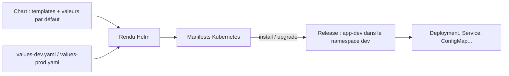

# Charts Helm — les essentiels

## Sommaire

- [Principe](#principe)
- [Créer un chart](#créer-un-chart)
- [Configurer et vérifier](#configurer-et-vérifier)
- [Installer et mettre à jour](#installer-et-mettre-à-jour)
- [Partager un chart](#partager-un-chart)
- [Les réflexes senior](#les-réflexes-senior)
- [Questions classiques](#questions-classiques)

## Principe

**Helm** gère des applications Kubernetes à partir de paquets appelés **charts**. Un chart contient des templates de manifests et des valeurs par défaut. Une **release** est une installation nommée d'un chart ; chaque mise à jour produit une nouvelle révision.



Le chart est réutilisable ; la release représente son installation. `helm template` effectue seulement le rendu local. [Utilisation de Helm](https://docs.helm.sh/docs/intro/using_helm/).

## Créer un chart

Prérequis : Helm installé ; pour déployer, un cluster Kubernetes accessible et un contexte `kubectl` configuré.

```bash
helm version
helm create mon-app
```

Le générateur fournit un exemple de chart à adapter :

```text
mon-app/
├── Chart.yaml          # Métadonnées et dépendances
├── values.yaml         # Valeurs par défaut
├── charts/             # Charts dépendants
├── templates/          # Manifests paramétrés
│   ├── deployment.yaml
│   ├── service.yaml
│   └── _helpers.tpl    # Fonctions de template partagées
└── .helmignore         # Fichiers exclus du paquet
```

Dans `Chart.yaml`, les deux versions ont des rôles différents :

```yaml
apiVersion: v2
name: mon-app
description: Application de démonstration
type: application
version: 0.1.0
appVersion: "1.0.0"
```

`version` identifie le **chart** ; `appVersion` décrit la version de l'**application**. Cette dernière ne change l'image déployée que si les templates l'utilisent. [Structure des charts](https://helm.sh/docs/topics/charts/).

Extrait illustratif d'un template, pas un Deployment complet :

```yaml
spec:
  replicas: {{ .Values.replicaCount }}
```

`.Values` lit les paramètres ; `.Release.Name` donne le nom de la release. Les expressions `{{ ... }}` sont évaluées avant l'envoi des manifests à Kubernetes.

## Configurer et vérifier

À côté du dossier `mon-app/`, créer `values-dev.yaml` :

```yaml
replicaCount: 1
service:
  type: ClusterIP
```

Pour `values-prod.yaml`, commencer par :

```yaml
replicaCount: 3
service:
  type: ClusterIP
resources:
  requests:
    cpu: 100m
    memory: 128Mi
  limits:
    memory: 256Mi
```

Ces valeurs illustrent le mécanisme ; dimensionner les ressources selon l'application. Avec l'autoscaling activé, vérifier comment le chart traite `replicaCount`.

```bash
helm lint ./mon-app -f values-dev.yaml
helm template app-dev ./mon-app -n dev -f values-dev.yaml
```

Les valeurs explicites écrasent les défauts du chart. Avec plusieurs fichiers `-f`, le dernier gagne en cas de conflit ; `--set` prend priorité. Préférer les fichiers versionnés pour les configurations durables. [Gestion des valeurs](https://docs.helm.sh/docs/helm/helm_upgrade/).

## Installer et mettre à jour

Vérifier d'abord le cluster ciblé, puis lancer depuis le dossier contenant `mon-app/` :

```bash
kubectl config current-context
helm upgrade --install app-dev ./mon-app -n dev --create-namespace -f values-dev.yaml --wait --timeout 5m
helm list -n dev
helm status app-dev -n dev
kubectl get pods,svc -n dev
```

`upgrade --install` installe si la release n'existe pas, sinon la met à jour. Après modification du chart ou des valeurs, relancer la même commande. Le `--wait` attend l'état attendu des ressources prises en charge ; il ne remplace pas un test fonctionnel. Un échec ne provoque pas automatiquement un rollback avec cette commande.

Inspecter les paramètres et l'historique :

```bash
helm get values app-dev -n dev --all
helm history app-dev -n dev
```

Revenir à une révision existante, par exemple `1`, après lecture de l'historique :

```bash
helm rollback app-dev 1 -n dev --wait --timeout 5m
```

Le rollback crée une nouvelle révision à partir d'une ancienne ; il ne restaure pas les données d'une base. [Commande rollback](https://docs.helm.sh/docs/helm/helm_rollback/).

Pour supprimer la release de lab :

```bash
helm uninstall app-dev -n dev
```

Le namespace n'est pas supprimé par cette commande. Vérifier séparément les données persistantes à conserver.

## Partager un chart

Créer une archive distribuable :

```bash
helm package ./mon-app
```

Avec `version: 0.1.0`, elle s'appelle `mon-app-0.1.0.tgz`. Un consommateur peut l'utiliser ainsi :

```bash
helm install app-dev ./mon-app-0.1.0.tgz -n dev --create-namespace -f values-dev.yaml
```

Cette commande est une alternative à l'installation précédente : elle exige que la release `app-dev` n'existe pas déjà. Les charts peuvent aussi être distribués via un dépôt Helm ou un registre OCI. Fixer leur version lors de la consommation.

Pour un chart avec des dépendances déclarées dans `Chart.yaml`, `helm dependency update` résout les versions et produit `Chart.lock` ; `helm dependency build` reconstruit les dépendances depuis ce verrou. Commiter `Chart.lock`. [Commandes Helm](https://helm.sh/docs/helm/).

## Les réflexes senior

- **Contrat de configuration** : documenter les valeurs utiles et ajouter un `values.schema.json` pour valider les types et contraintes. Éviter les dizaines d'options sans usage réel.
- **Reproductibilité** : maîtriser version du chart, dépendances et images. Préférer un digest pour fixer exactement une image ; ne pas confondre version du chart et version applicative.
- **Qualité du déploiement** : définir probes, ressources, stratégie de rollout et règles de sécurité adaptées. Trois replicas seuls ne garantissent pas la haute disponibilité.
- **Validation progressive** : lint, rendu, validation Kubernetes puis déploiement de test. `helm test` exécute les tests fournis par le chart ; leur pertinence dépend de leur contenu.
- **Secrets** : ne pas committer de secrets dans les values. Les valeurs et manifests peuvent être conservés dans les métadonnées de release ; protéger leurs accès et préférer des références à des secrets gérés séparément.
- **Migrations** : concevoir les changements de données pour supporter un retour applicatif. Un rollback Helm n'annule pas une migration SQL ni tous les effets d'un hook.
- **GitOps** : si un contrôleur pilote la release, modifier la source déclarative. Un changement manuel peut être réconcilié et annulé.

## Questions classiques

**Chart, release, révision ?** Le chart est le paquet ; la release est son installation nommée ; la révision est une étape de son historique.

**Chart d'application ou library chart ?** Un chart `application` sert à déployer ; un chart `library` fournit des templates réutilisables à d'autres charts et ne s'installe pas directement.

**Helm remplace-t-il Kubernetes ?** Non. Helm génère et gère les manifests ; les contrôleurs Kubernetes assurent ensuite leur exécution.

**`helm lint` réussit : le déploiement est-il garanti ?** Non. Les APIs du cluster, les quotas, les droits, les images et le comportement de l'application restent à vérifier.

**Comment diagnostiquer un échec ?** Lire `helm status`, puis les événements, `kubectl describe` et les logs des pods. Distinguer rendu incorrect, refus de l'API et application non prête.

**Comment choisir les options de rollback automatique ?** Vérifier la version installée et `helm upgrade --help` : Helm 3 utilise notamment `--atomic`, Helm 4 propose `--rollback-on-failure`. Ne pas supposer les options identiques entre versions majeures. [Helm 3](https://v3.helm.sh/docs/v3/helm/helm_upgrade/), [Helm 4](https://docs.helm.sh/docs/helm/helm_upgrade/).
