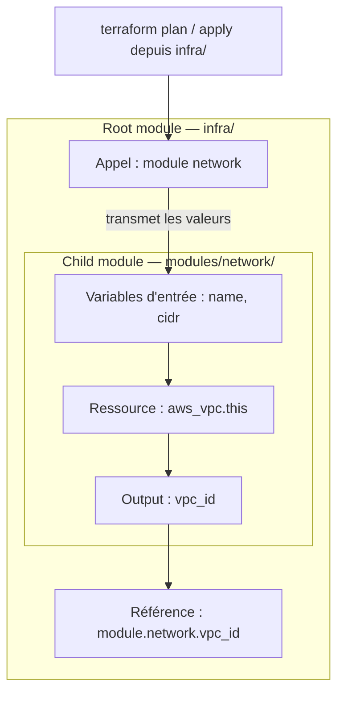
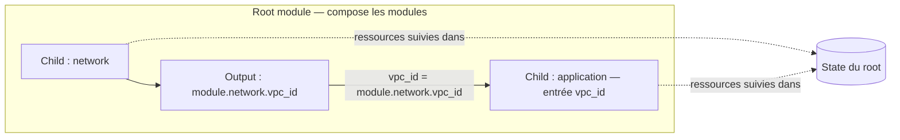

# Modules Terraform — les essentiels

## Sommaire

- [Principe](#principe)
- [Créer un module](#créer-un-module)
- [Utiliser le module](#utiliser-le-module)
- [Versionner et partager](#versionner-et-partager)
- [Les réflexes senior](#les-réflexes-senior)
- [Questions classiques](#questions-classiques)

## Principe

Un module est un dossier de fichiers `.tf` qui expose des **variables d'entrée**, crée des **ressources** et publie des **outputs**. Le dossier depuis lequel on lance Terraform est le **root module** ; les modules qu'il appelle sont des **child modules**.



Les flèches montrent le passage des valeurs, pas un ordre d'exécution des fichiers `.tf`. Le child est appelé par le root ; on ne lance pas un `apply` séparé dans chaque module.

L'objectif : réutiliser un composant cohérent (réseau, base de données, application), avec des conventions et des valeurs par défaut. Éviter le module géant qui fait tout ou la simple copie de chaque option du provider.

## Créer un module

Exemple AWS minimal : un VPC. Terraform et des identifiants AWS sont nécessaires pour exécuter le plan ; les identifiants restent hors du code.

```text
infra/
├── main.tf
└── modules/
    └── network/
        ├── main.tf
        ├── variables.tf
        ├── outputs.tf
        ├── versions.tf
        └── README.md
```

`modules/network/variables.tf` — définir le contrat d'entrée :

```hcl
variable "name" {
  description = "Nom du réseau"
  type        = string
}

variable "cidr" {
  description = "Bloc IPv4 du VPC"
  type        = string

  validation {
    condition     = can(cidrnetmask(var.cidr))
    error_message = "Le CIDR doit être un bloc IPv4 valide."
  }
}
```

`modules/network/main.tf` — implémenter les ressources :

```hcl
resource "aws_vpc" "this" {
  cidr_block           = var.cidr
  enable_dns_support   = true
  enable_dns_hostnames = true

  tags = { Name = var.name }
}
```

`modules/network/outputs.tf` — exposer ce dont les consommateurs ont besoin :

```hcl
output "vpc_id" {
  description = "Identifiant du VPC créé"
  value       = aws_vpc.this.id
}
```

`modules/network/versions.tf` — déclarer les dépendances :

```hcl
terraform {
  required_version = ">= 1.6.0"
  required_providers {
    aws = {
      source  = "hashicorp/aws"
      version = ">= 5.0"
    }
  }
}
```

Ces contraintes illustrent une base de compatibilité, pas les dernières versions disponibles. Documenter dans le README les entrées, sorties, prérequis et un exemple d'appel. Les fichiers `.tf` d'un dossier sont lus ensemble : leurs noms servent à organiser le code. [Structure officielle](https://developer.hashicorp.com/terraform/language/modules/develop/structure).

## Utiliser le module

Dans `infra/main.tf` :

```hcl
terraform {
  required_version = ">= 1.6.0"
  required_providers {
    aws = {
      source  = "hashicorp/aws"
      version = "~> 5.0"
    }
  }
}

provider "aws" {
  region = "eu-west-3"
}

module "network" {
  source = "./modules/network"
  name   = "app-dev"
  cidr   = "10.10.0.0/16"
}

output "vpc_id" {
  value = module.network.vpc_id
}
```

Depuis `infra/` :

```bash
terraform fmt -recursive
terraform init
terraform validate
terraform plan -out=tfplan
# Après revue du plan, pour créer les ressources :
terraform apply tfplan
```

Le root configure le provider ; le child déclare ses exigences et hérite de la configuration par défaut. Pour un autre compte ou une autre région, passer une configuration aliasée avec `providers = { aws = aws.secondary }`. Les alias requis à l'intérieur d'un child se déclarent via `configuration_aliases`. [Providers dans les modules](https://developer.hashicorp.com/terraform/language/modules/develop/providers).

## Versionner et partager

Deux alternatives au chemin local, à adapter à votre dépôt :

```hcl
# Registry privé : adresse illustrative
module "network" {
  source  = "app.terraform.io/mon-organisation/network/aws"
  version = "1.2.0"
  name    = "app-prod"
  cidr    = "10.20.0.0/16"
}

# Git : exemple alternatif, ne pas déclarer les deux pour le même besoin
module "network_git" {
  source = "git::https://gitlab.example.com/platform/terraform-modules.git//modules/network?ref=v1.2.0"
  name   = "app-prod"
  cidr   = "10.20.0.0/16"
}
```

`version` s'utilise avec un registry ; pour Git, utiliser `ref` (un SHA de commit pour une référence immuable). Éviter une branche mouvante en production. Relancer `terraform init` après modification de la source ou de la version. [Référence du bloc module](https://developer.hashicorp.com/terraform/language/block/module).

Versionner le contrat : correctif compatible → patch, ajout compatible → minor, rupture → major. Documenter les migrations. Le fichier `.terraform.lock.hcl` verrouille les **providers**, pas les modules ; le committer dans le root et fixer séparément les versions des modules. [Lock file](https://developer.hashicorp.com/terraform/language/files/dependency-lock).

## Les réflexes senior

**Composition de deux modules depuis le même root :**



Le module `application` est illustratif. La référence à l'output exprime la dépendance ; les deux child modules partagent ici le state du root.

- **Interface stable** : variables typées, descriptions, validations et peu d'options utiles ; ne pas imposer une région ou des identifiants dans le child.
- **Composition** : transmettre les outputs entre modules, par exemple `vpc_id = module.network.vpc_id`. Terraform en déduit la dépendance ; réserver `depends_on` aux dépendances invisibles dans les références.
- **State** : un child n'a pas automatiquement son propre state. Ses ressources appartiennent au state du root appelant. Séparer dev/prod avec des states et des droits adaptés ; configurer le backend au niveau root.
- **Secrets** : `sensitive = true` masque l'affichage habituel, mais ne garantit pas l'absence de la valeur dans le state. Protéger state et plans, ne pas les committer.
- **Validation** : en CI, vérifier format, validation et tests du contrat avec `terraform test`. Les tests peuvent créer de vraies ressources : choisir explicitement tests de plan, mocks ou environnement isolé selon le besoin. [Tests Terraform](https://developer.hashicorp.com/terraform/language/tests).
- **Évolution sans destruction** : renommer une ressource change son adresse. Ajouter un bloc `moved`, puis examiner le plan et tester la migration avant publication.

Exemple dans le module : après avoir renommé `aws_vpc.this` en `aws_vpc.main`, conserver cette migration :

```hcl
moved {
  from = aws_vpc.this
  to   = aws_vpc.main
}
```

Ce bloc préserve l'association dans le state ; il n'empêche pas un remplacement causé par un autre changement de configuration. [Refactoring officiel](https://developer.hashicorp.com/terraform/language/modules/develop/refactoring).

## Questions classiques

**Module ou environnement séparé ?** Un module réutilise du code. Un root et son state définissent un périmètre de déploiement. Réutilisation et isolation sont deux décisions distinctes.

**`count` ou `for_each` pour appeler plusieurs fois un module ?** `count` identifie les instances par index ; `for_each` par clés stables, souvent préférables pour des composants nommés. Changer une clé change l'adresse : prévoir une migration.

**Comment mettre à jour un module en production ?** Lire les changements, fixer la nouvelle version, initialiser, tester en non-production puis examiner le plan de production avant application. Revenir à l'ancienne version du code ne restaure pas automatiquement les données ou le state.

**Qu'est-ce qui distingue un bon module senior ?** Un périmètre clair, un contrat simple, des valeurs par défaut sûres, des versions maîtrisées et une migration testée pour les utilisateurs existants.
