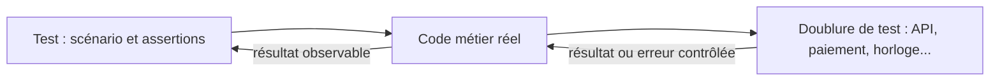

# Tests unitaires avec pytest et Jest

## Sommaire

- [Principe](#principe)
- [Mock, stub, spy et fake](#mock-stub-spy-et-fake)
- [Exemple avec pytest](#exemple-avec-pytest)
- [Exemple avec Jest](#exemple-avec-jest)
- [Isolation et nettoyage](#isolation-et-nettoyage)
- [Les réflexes senior](#les-réflexes-senior)
- [Questions classiques](#questions-classiques)

## Principe

Un **test unitaire** vérifie un comportement limité, rapidement et de manière déterministe. Isoler les dépendances externes permet de tester les cas de succès et d'échec sans réseau ni base réelle.

Structurer le test en **Arrange → Act → Assert** : préparer les données, appeler le code, vérifier le résultat observable.



Garder le code testé réel ; remplacer ses dépendances quand cela aide à contrôler le scénario. Compléter avec des tests d'intégration pour vérifier les connexions réelles et quelques tests de bout en bout pour les parcours critiques.

## Mock, stub, spy et fake

- **Stub** : fournit une réponse prédéfinie, par exemple un client retrouvé dans un annuaire.
- **Mock** : permet de vérifier les interactions attendues, par exemple un paiement demandé une seule fois avec le bon montant.
- **Spy** : observe les appels à une fonction ; selon sa configuration, il peut laisser la fonction réelle s'exécuter.
- **Fake** : implémentation simplifiée mais fonctionnelle, par exemple un dépôt en mémoire.

Les outils recouvrent plusieurs usages : `Mock` ou `jest.fn()` peuvent servir de stub lorsqu'on configure seulement leur retour, puis de mock lorsqu'on vérifie leurs appels. Une **fixture** prépare les données ou ressources d'un test ; ce n'est pas une catégorie de mock.

## Exemple avec pytest

Dans un dossier de lab Python, installer les dépendances, idéalement dans un environnement virtuel :

```bash
python -m pip install pytest pytest-cov
```

`payment.py` — le client de paiement est injecté pour contrôler cette dépendance :

```python
def pay_order(amount_cents, charge):
    if amount_cents <= 0:
        raise ValueError("amount must be positive")
    return charge(amount_cents)
```

`test_payment.py` :

```python
from unittest.mock import Mock

import pytest

from payment import pay_order


@pytest.fixture
def charge():
    return Mock(return_value="payment-123")


def test_charges_the_requested_amount(charge):
    result = pay_order(1500, charge)

    assert result == "payment-123"
    charge.assert_called_once_with(1500)


@pytest.mark.parametrize("amount", [0, -1])
def test_rejects_invalid_amount_without_charging(amount, charge):
    with pytest.raises(ValueError, match="amount must be positive"):
        pay_order(amount, charge)

    charge.assert_not_called()


def test_propagates_provider_failure(charge):
    charge.side_effect = TimeoutError("provider unavailable")

    with pytest.raises(TimeoutError, match="provider unavailable"):
        pay_order(1500, charge)

    charge.assert_called_once_with(1500)
```

```bash
python -m pytest -q
python -m pytest --cov=payment --cov-report=term-missing
```

La fixture fournit un mock neuf à chaque test. Le dernier scénario documente ici la propagation de l'erreur, sans retry automatique. En production, définir explicitement la politique de retry et d'idempotence des paiements.

`unittest.mock` appartient à Python ; la fixture `mocker` nécessite le plugin distinct `pytest-mock`. Pour contraindre un mock à une vraie interface, utiliser `create_autospec` et éventuellement `spec_set`. [Documentation des mocks Python](https://docs.python.org/3/library/unittest.mock.html).

## Exemple avec Jest

Exemple pour un lab JavaScript **CommonJS** (sans `"type": "module"`), avec Node.js et npm :

```bash
npm init -y
npm install --save-dev jest
```

`payment.js` — même contrat, cette fois avec une dépendance asynchrone :

```javascript
async function payOrder(amountCents, charge) {
  if (amountCents <= 0) {
    throw new Error('amount must be positive');
  }
  return await charge(amountCents);
}

module.exports = { payOrder };
```

`payment.test.js` :

```javascript
const { payOrder } = require('./payment');

test('charges the requested amount', async () => {
  const charge = jest.fn().mockResolvedValue('payment-123');

  await expect(payOrder(1500, charge)).resolves.toBe('payment-123');
  expect(charge).toHaveBeenCalledTimes(1);
  expect(charge).toHaveBeenCalledWith(1500);
});

test.each([0, -1])('rejects invalid amount %i without charging', async (amount) => {
  const charge = jest.fn();

  await expect(payOrder(amount, charge)).rejects.toThrow('amount must be positive');
  expect(charge).not.toHaveBeenCalled();
});

test('propagates provider failure', async () => {
  const charge = jest.fn().mockRejectedValue(new Error('provider unavailable'));

  await expect(payOrder(1500, charge)).rejects.toThrow('provider unavailable');
  expect(charge).toHaveBeenCalledTimes(1);
});
```

```bash
npx jest
npx jest --coverage --collectCoverageFrom=payment.js
```

Toujours attendre ou retourner la promesse d'une assertion asynchrone. Les exemples injectent la dépendance pour éviter de coupler le test au mécanisme d'import. Un projet ESM ou TypeScript nécessite une configuration adaptée. [Mocks Jest](https://jestjs.io/docs/mock-function-api).

## Isolation et nettoyage

**pytest** : utiliser `tmp_path` pour les fichiers temporaires, `monkeypatch` pour remplacer une variable d'environnement ou un attribut, et une fixture avec `yield` puis nettoyage pour les ressources ouvertes. Les changements de `monkeypatch` sont annulés après leur portée. [Monkeypatch](https://docs.pytest.org/en/stable/how-to/monkeypatch.html).

Si un module fait `from api import fetch`, patcher `fetch` dans le module qui l'utilise, pas uniquement dans `api` : le remplacement doit viser l'endroit où le nom est recherché.

**Jest** : créer les mocks dans chaque test ou dans `beforeEach`. Pour des spies ou des timers modifiés :

```javascript
afterEach(() => {
  jest.restoreAllMocks();
  jest.useRealTimers();
});
```

- `clearAllMocks()` efface l'historique des appels, conserve les implémentations.
- `resetAllMocks()` efface aussi les implémentations configurées des mocks.
- `restoreAllMocks()` restaure notamment les fonctions remplacées par `jest.spyOn` ; il ne restaure pas une affectation manuelle avec `jest.fn()`.

Attention : `jest.spyOn(obj, 'method')` appelle par défaut la vraie méthode. Ajouter `mockImplementation` ou un retour simulé si l'effet réel est indésirable. [API des mocks](https://jestjs.io/docs/mock-function-api).

## Les réflexes senior

- **Tester le contrat** : résultats, erreurs et effets métier importants. Éviter de vérifier chaque appel interne, ce qui rend les refactorings coûteux.
- **Choisir les scénarios** : nominal, limites, entrée invalide et panne externe. Utiliser `parametrize` ou `test.each` pour les variantes d'une même règle.
- **Ne pas tout mocker** : un mock ne prouve pas que l'API réelle accepte la requête. Ajouter des tests d'intégration ou de contrat aux frontières critiques.
- **Éliminer l'aléatoire** : contrôler heure, identifiants, timers et données. Éviter les attentes réelles avec `sleep` ; utiliser les fake timers de Jest lorsque pertinent.
- **Garder les tests indépendants** : aucun ordre imposé ni état global partagé. Une fixture trop large ou une base commune mutable peut créer des tests instables.
- **Mesurer utilement** : couverture de branches et code critique, pas seulement pourcentage de lignes. En complément, le mutation testing aide à repérer les assertions trop faibles.
- **Intégrer en CI** : versions de dépendances maîtrisées, tests unitaires à chaque merge request, rapport de couverture et tests d'intégration séparés selon leur coût. Corriger les tests instables plutôt que masquer leurs échecs par des retries systématiques.

## Questions classiques

**Quand vérifier un appel plutôt qu'un résultat ?** Quand l'interaction est le comportement attendu, comme envoyer une notification ou déclencher un paiement. Pour un calcul pur, vérifier principalement le résultat.

**100 % de couverture signifie-t-il zéro bug ?** Non. Une ligne exécutée n'implique ni une bonne assertion ni la couverture de tous les cas métier.

**Pourquoi mon patch n'a-t-il aucun effet ?** Vérifier le nom réellement utilisé par le code et le moment de l'import. Préférer l'injection de dépendance lorsqu'elle simplifie le contrat.

**Un fake en mémoire remplace-t-il une vraie base dans tous les tests ?** Non. Transactions, contraintes et requêtes peuvent se comporter différemment ; les tester aussi avec le moteur réel.

**Pourquoi un test async passe-t-il alors qu'il devrait échouer ?** Chercher une promesse non attendue, un callback jamais exécuté ou une erreur interceptée sans assertion.

**Faut-il tester une méthode privée ?** Tester en priorité le comportement public. Une logique privée très complexe peut signaler un composant à extraire et à tester séparément.
